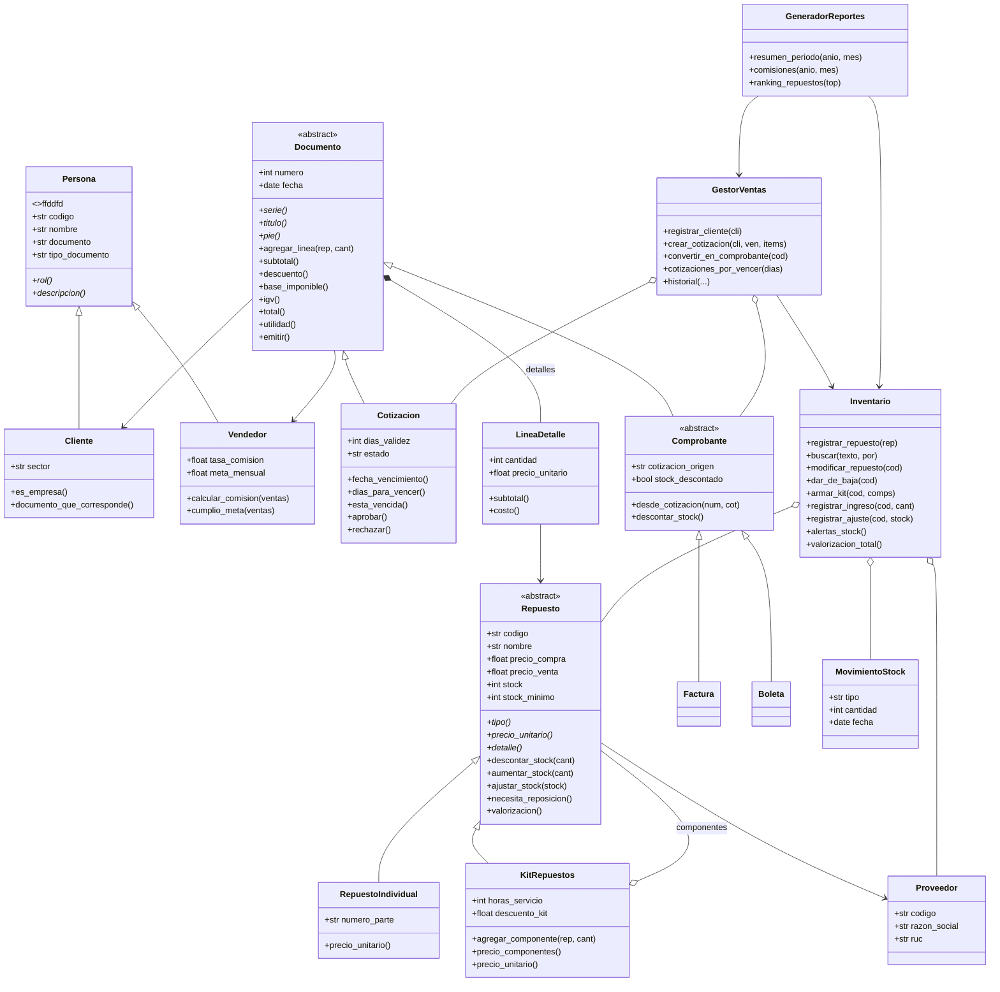
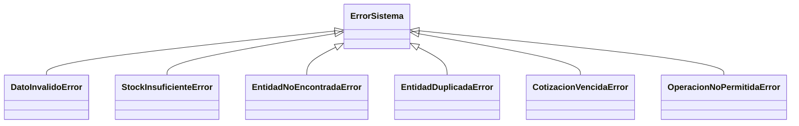

# Diagrama de clases (Hito 2)

Diagrama en formato Mermaid: GitHub lo renderiza automáticamente en este archivo.

```mermaid
classDiagram
    class Persona {
        <<abstract>>ffddfd
        +str codigo
        +str nombre
        +str documento
        +str tipo_documento
        +rol()*
        +descripcion()*
    }
    class Cliente {
        +str sector
        +es_empresa()
        +documento_que_corresponde()
    }
    class Vendedor {
        +float tasa_comision
        +float meta_mensual
        +calcular_comision(ventas)
        +cumplio_meta(ventas)
    }
    Persona <|-- Cliente
    Persona <|-- Vendedor

    class Repuesto {
        <<abstract>>
        +str codigo
        +str nombre
        +float precio_compra
        +float precio_venta
        +int stock
        +int stock_minimo
        +tipo()*
        +precio_unitario()*
        +detalle()*
        +descontar_stock(cant)
        +aumentar_stock(cant)
        +ajustar_stock(stock)
        +necesita_reposicion()
        +valorizacion()
    }
    class RepuestoIndividual {
        +str numero_parte
        +precio_unitario()
    }
    class KitRepuestos {
        +int horas_servicio
        +float descuento_kit
        +agregar_componente(rep, cant)
        +precio_componentes()
        +precio_unitario()
    }
    Repuesto <|-- RepuestoIndividual
    Repuesto <|-- KitRepuestos
    KitRepuestos o-- Repuesto : componentes

    class Documento {
        <<abstract>>
        +int numero
        +date fecha
        +serie()*
        +titulo()*
        +pie()*
        +agregar_linea(rep, cant)
        +subtotal()
        +descuento()
        +base_imponible()
        +igv()
        +total()
        +utilidad()
        +emitir()
    }
    class Cotizacion {
        +int dias_validez
        +str estado
        +fecha_vencimiento()
        +dias_para_vencer()
        +esta_vencida()
        +aprobar()
        +rechazar()
    }
    class Comprobante {
        <<abstract>>
        +str cotizacion_origen
        +bool stock_descontado
        +desde_cotizacion(num, cot)
        +descontar_stock()
    }
    class Factura
    class Boleta
    Documento <|-- Cotizacion
    Documento <|-- Comprobante
    Comprobante <|-- Factura
    Comprobante <|-- Boleta

    class LineaDetalle {
        +int cantidad
        +float precio_unitario
        +subtotal()
        +costo()
    }
    Documento *-- LineaDetalle : detalles
    LineaDetalle --> Repuesto
    Documento --> Cliente
    Documento --> Vendedor

    class Proveedor {
        +str codigo
        +str razon_social
        +str ruc
    }
    Repuesto --> Proveedor

    class MovimientoStock {
        +str tipo
        +int cantidad
        +date fecha
    }

    class Inventario {
        +registrar_repuesto(rep)
        +buscar(texto, por)
        +modificar_repuesto(cod)
        +dar_de_baja(cod)
        +armar_kit(cod, comps)
        +registrar_ingreso(cod, cant)
        +registrar_ajuste(cod, stock)
        +alertas_stock()
        +valorizacion_total()
    }
    class GestorVentas {
        +registrar_cliente(cli)
        +crear_cotizacion(cli, ven, items)
        +convertir_en_comprobante(cod)
        +cotizaciones_por_vencer(dias)
        +historial(...)
    }
    class GeneradorReportes {
        +resumen_periodo(anio, mes)
        +comisiones(anio, mes)
        +ranking_repuestos(top)
    }
    Inventario o-- Repuesto
    Inventario o-- Proveedor
    Inventario o-- MovimientoStock
    GestorVentas o-- Cotizacion
    GestorVentas o-- Comprobante
    GestorVentas --> Inventario
    GeneradorReportes --> Inventario
    GeneradorReportes --> GestorVentas
```

## Excepciones

```mermaid
classDiagram
    class ErrorSistema
    ErrorSistema <|-- DatoInvalidoError
    ErrorSistema <|-- StockInsuficienteError
    ErrorSistema <|-- EntidadNoEncontradaError
    ErrorSistema <|-- EntidadDuplicadaError
    ErrorSistema <|-- CotizacionVencidaError
    ErrorSistema <|-- OperacionNoPermitidaError
```
